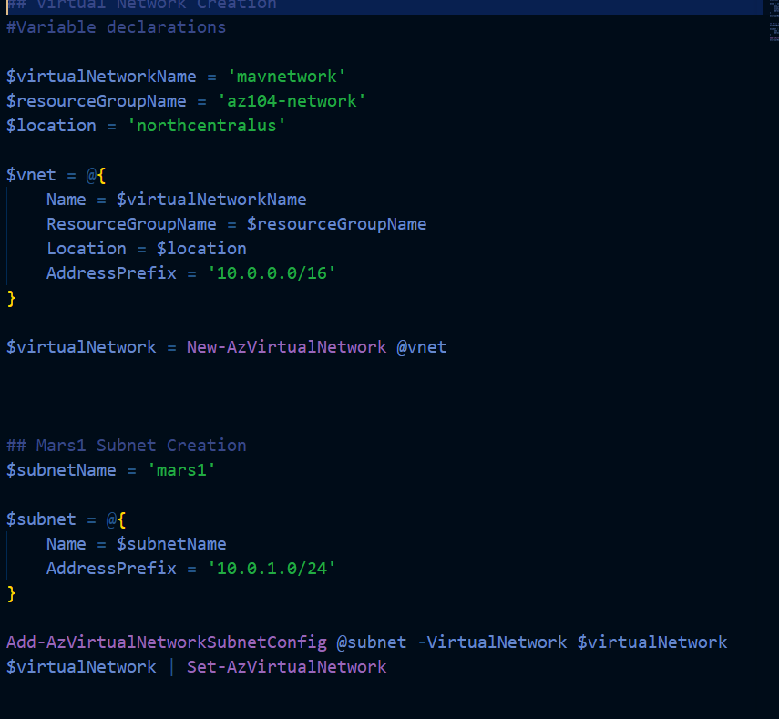
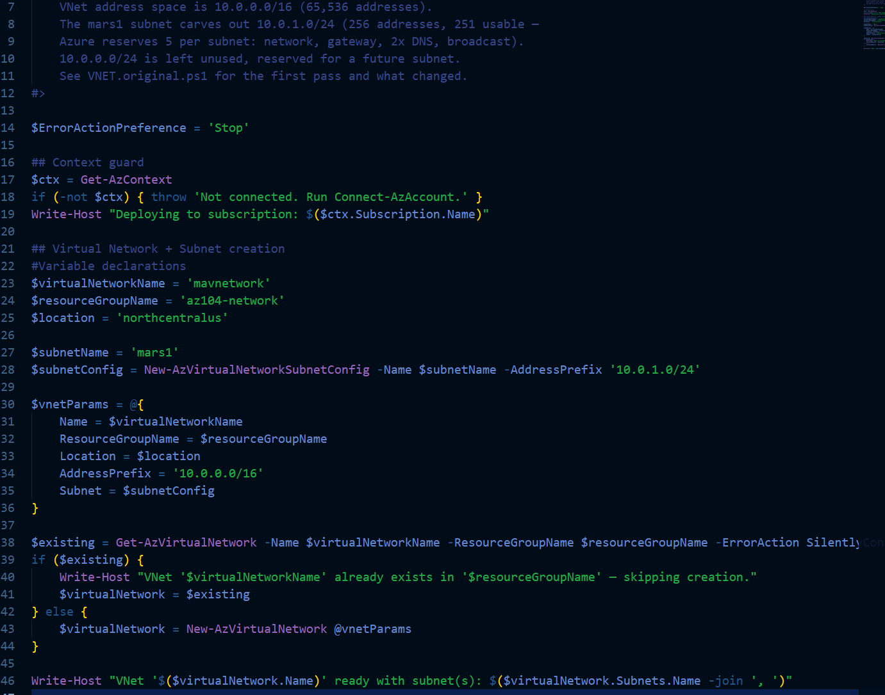

# Building the Network — The Story So Far

**Goal:** stand up a virtual network for the AZ-104 lab, understand every line that builds it, and document the mistakes along the way instead of hiding them.

---

## Attempt 1 — It Worked, But I Didn't Know Why



The first version of [VNET.ps1](VNET.ps1) ([VNET.original.ps1](VNET.original.ps1) keeps this exact version preserved) does two things:

1. Creates an empty VNet (`mavnetwork`, `10.0.0.0/16`) with `New-AzVirtualNetwork`.
2. Builds a subnet (`mars1`, `10.0.1.0/24`) and staples it onto that VNet with `Add-AzVirtualNetworkSubnetConfig`, then pushes the change to Azure with `Set-AzVirtualNetwork`.

It ran. The subnet showed up in Azure. Job done — or so I thought.

### What I got wrong

`Add-AzVirtualNetworkSubnetConfig` returns an updated copy of the VNet object. I never captured that return value:

```powershell
Add-AzVirtualNetworkSubnetConfig @subnet -VirtualNetwork $virtualNetwork
$virtualNetwork | Set-AzVirtualNetwork
```

This *should* have been:

```powershell
$virtualNetwork = Add-AzVirtualNetworkSubnetConfig @subnet -VirtualNetwork $virtualNetwork
```

It only worked by accident — the cmdlet also happens to mutate `$virtualNetwork` in place as a side effect, so line 2 picked up the subnet anyway. The lesson isn't "it was broken," it's that **it worked for a reason I didn't understand**, which is arguably worse for a lab whose whole point is understanding the *why*. Relying on an undocumented side effect instead of the actual return value is a habit that will eventually break silently, on some future cmdlet that doesn't happen to be as forgiving.

### Other gaps in this pass

- No check for whether I was even logged into the right subscription.
- No error handling — a failed `New-AzVirtualNetwork` would leave `$virtualNetwork` empty and the next command would fail with a confusing null-reference error instead of the real Azure error.
- Not safe to re-run — running it twice fails with "already exists" instead of just confirming the VNet is there.
- Two separate calls to Azure (create VNet, then update it) to do something that can be done in one.

---

## Attempt 2 — Refactored With the Failures in Mind



The current [VNET.ps1](VNET.ps1) fixes each of those, one problem at a time:

| Problem in Attempt 1 | Fix in Attempt 2 |
|---|---|
| Discarded return value, relied on a side effect | Subnet is built with `New-AzVirtualNetworkSubnetConfig` *before* the VNet exists, and passed straight into `New-AzVirtualNetwork` — one call, no silent mutation to depend on |
| No check on which subscription I was deploying into | `Get-AzContext` guard at the top — throws immediately with a clear message if not logged in |
| Errors could fail silently and cascade | `$ErrorActionPreference = 'Stop'` — the script halts at the actual point of failure |
| Re-running the script failed on "already exists" | `Get-AzVirtualNetwork` checks first; if found, it reuses it instead of erroring |
| Two round-trips to Azure | Down to one — the subnet is included in the `New-AzVirtualNetwork` call instead of added afterward |

### The trade-off worth naming

Collapsing the two-step "create, then add a subnet" pattern into a single call is more efficient, but it also means I'm no longer practicing the *other* real-world pattern: adding a subnet to a VNet that **already exists**. That's a genuinely different and common admin task (the original script's approach, done correctly with the return value captured). If I want to keep exercising that pattern, the right move is a **separate script** for "add a subnet to an existing VNet," not bolting it back onto this one.

---

## What This Taught Me

- A command running without an error is not the same as a command being *correct*. `Add-AzVirtualNetworkSubnetConfig` "worked" while hiding exactly the kind of gap in understanding this lab exists to close.
- Capture return values. Don't assume a cmdlet mutating something in place is guaranteed behavior — it's an implementation detail, not a contract.
- Idempotency (safe to re-run) and error handling aren't extra polish for a lab script — they're what makes it possible to iterate quickly without a re-run turning into a cleanup chore.
- There's more than one correct way to build the same resource in Azure, and the "better" one depends on what you're actually trying to practice, not just which is fewer lines.

---

## Attempt 3 — Adding a Subnet to an Existing VNet, For Real This Time

This closes the first TODO above, and it exists because of a Compute-lab need: Azure Bastion (see `Compute/`) requires its own subnet, in the same VNet as the VM it protects, named **exactly** `AzureBastionSubnet` and sized at least `/26`. `mavnetwork` already had `10.0.0.0/24` sitting unused — reserved back in Attempt 2 for exactly this kind of future need — so I carved `10.0.0.0/26` (64 addresses) out of it.

[Add-Subnet.ps1](Add-Subnet.ps1) does what Attempt 1 of `VNET.ps1` *should* have done: it captures the return value of `Add-AzVirtualNetworkSubnetConfig` instead of relying on it mutating `$virtualNetwork` as a side effect.

```powershell
$virtualNetwork = Add-AzVirtualNetworkSubnetConfig -Name $SubnetName -AddressPrefix $AddressPrefix -VirtualNetwork $virtualNetwork
$virtualNetwork = $virtualNetwork | Set-AzVirtualNetwork
```

It also checks whether the subnet already exists before adding it, so it's safe to re-run — same idempotency pattern as `VNET.ps1`. Ran clean on the first try:

```
Deploying to subscription: Azure for Students
Subnet 'AzureBastionSubnet' (10.0.0.0/26) added to 'mavnetwork'.
VNet 'mavnetwork' now has subnet(s): mars1, AzureBastionSubnet
```

**Region gotcha caught before writing any code:** the `az104-compute` resource group's default location is `eastus`, but `mavnetwork` was deployed in `northcentralus`. A NIC (or anything else) can only attach to a subnet that's in the *same region* as the VNet — region is a hard boundary for networking resources, unlike a resource group's "location," which is just metadata about where the RG's own deployment history lives. Every resource created for Compute explicitly passes `-Location northcentralus`, regardless of which RG it lands in.

---

## Attempt 4 — Locking Down mars1 with an NSG

This closes the second TODO above. [NSG-mars1.ps1](NSG-mars1.ps1) attaches a Network Security Group to `mars1` with exactly one rule: allow inbound TCP 3389 (RDP) from `10.0.0.0/26` (the `AzureBastionSubnet` range), nothing else. The idea is that once the Compute VM is up, the *only* path in is through Azure Bastion — not the open internet.

Every NSG ships with default rules (priority 65000+) that already deny all inbound traffic from the internet. Adding this rule isn't closing a hole that was open — it's about being explicit and auditable: "RDP is allowed from exactly this /26" should be something you can read in a script, not something you have to go verify against an implicit default.

I hit four real problems building this, in order:

### 1. `-Decscription` typo

```
New-AzNetworkSecurityRuleConfig: A parameter cannot be found that matches parameter name 'Decscription'.
```

No fuzzy matching on parameter names in PowerShell — a typo just isn't found. Fixed to `-Description`.

### 2. A comment after a line-continuation backtick breaks the whole statement

I had:

```powershell
-SourceAddressPrefix '10.0.0.0/26' ` ##Only traffic originating from the Bastion subnet is allowed in on 3389
```

A backtick only works as a line-continuation character when it's the **very last character on the line** — nothing after it, not even a space or a comment. I proved this out in isolation before touching the real script:

```powershell
function Test-Foo { param($A,$B) "A=$A B=$B" }
Test-Foo -A 1 ` ##comment
-B 2
```

```
A=1 B=
-B: The term '-B' is not recognized as a name of a cmdlet, function, script file, or executable program.
```

The broken backtick didn't just eat the rest of the line — it ended the statement early and **ran it immediately**, incomplete (`Test-Foo -A 1`, missing `-B`). The next line then got parsed as its own unrelated command, and `-B` isn't a command, hence the error. Mapped onto the real script, `New-AzNetworkSecurityRuleConfig` would have fired early, missing `SourcePortRange`, `DestinationAddressPrefix`, and `DestinationPortRange`, and the next line (`-SourcePortRange '*'`) would have blown up the same way `-B 2` did. Fix: move the comment to its own line, never trailing a continuation backtick.

### 3. `New-AzNetworkSecurityGroup` needs `-Force` for rules on management ports

```
New-AzNetworkSecurityGroup: PowerShell is in NonInteractive mode. Read and Prompt functionality is not available.
```

This one isn't a bug — it's a real Azure PowerShell safety guardrail. Any NSG rule that allows inbound access to a "management port" (RDP `3389`, SSH `22`) normally makes `New-AzNetworkSecurityGroup` pause and ask for interactive confirmation, because wide-open RDP/SSH is one of the most common ways Azure resources get compromised. Running the script through a non-interactive automation context meant that prompt had nowhere to go, so it threw instead of waiting. Confirmed with `Get-AzNetworkSecurityGroup` that the resource had actually deployed correctly *despite* the reported error — the ARM call itself succeeded before the doomed prompt fired. `-Force` tells the cmdlet "skip the confirmation, this is deliberate" — legitimate here since the source is already scoped to a narrow `/26`, not the open internet.

### 4. Missing `$` turned a variable reference into a literal string

```powershell
-AddressPrefix subnet.AddressPrefix
```

Without the `$`, PowerShell doesn't resolve "the `subnet` variable's `AddressPrefix` property" — it just passes the bareword `subnet.AddressPrefix` through as a literal string. Confirmed in isolation that this passes the literal text, not the real CIDR value. This one didn't error immediately because `Set-AzVirtualNetworkSubnetConfig` never talks to Azure — it's the same "...Config" pattern as `Add-AzVirtualNetworkSubnetConfig`: builds a local object only. The bad value would only have surfaced as an Azure-side validation error once pushed with `Set-AzVirtualNetwork` — a good reminder that these local `Config` cmdlets don't validate anything against the real service, they just build data. Fixed: `-AddressPrefix $subnet.AddressPrefix`.

### Filtering by name, not by index

```powershell
$subnet = $vnet.Subnets | Where-Object { $_.Name -eq 'mars1' }
```

Verified directly that `$vnet.Subnets[0]` is `mars1` right now — but *not* because of any address ordering (`AzureBastionSubnet`'s `10.0.0.0/26` is numerically lower than `mars1`'s `10.0.1.0/24`). It's index `0` purely because `mars1` was created first. Nothing in the Az SDK guarantees subnets stay in creation order — a future API response could return them differently with no warning, and `$vnet.Subnets[0]` would silently point at the wrong subnet. Filtering by name is explicit about *what* you want instead of assuming *where* it lives — same category of bug as the return-value issue in `VNET.original.ps1`: code that only works because of an implementation detail nobody ever promised to keep.

### Idempotency surprised me — in a good way, once I understood it

Re-running `NSG-mars1.ps1` a second time produced **no error at all**, unlike `VNET.original.ps1`'s "already exists" failure on a second run. Reason: `New-AzNetworkSecurityGroup` maps to an ARM `PUT`, which means "make this resource match exactly what I'm sending," whether it already exists or not — run it twice with the same input, same result, no complaint. `New-AzVirtualNetwork`, by contrast, calls an API that rejects duplicates outright. Different resource types, different underlying behaviors — the cmdlet name pattern doesn't tell you which one you're getting; you have to test it.

The sharp edge: `-SecurityRules $rdpFromBastion` declares the *complete* rule list, not an addition to it. If I'd manually added a second rule in the Portal and then re-ran this script, the manual rule would be silently deleted — no error, no warning — because as far as the script's concerned, its one rule *is* the whole desired state. That's the same principle Bicep/Terraform "apply" runs on, and it's worth knowing rather than being surprised by later.

---

## What This Taught Me (Attempts 3 & 4)

- Region is a hard boundary for networking resources; resource group "location" is just metadata. Always pass `-Location` explicitly rather than trusting the RG default.
- A backtick line-continuation character must be the literal last character on the line — no trailing whitespace, no trailing comment.
- Not every confirmation prompt is a bug to route around blindly. The RDP/SSH `-Force` prompt is a real security control; using `-Force` should mean "I've reviewed this," not "make the error go away."
- A script "not erroring" isn't the same as a script "doing what you think." The missing `$` bug produced silence, not a crash, because the cmdlet it hit was local-only — errors that don't surface immediately can still be sitting there waiting.
- Filter collections by an identifying property (name), never by positional index, unless the source explicitly guarantees ordering.
- Idempotency isn't one universal behavior — some Az cmdlets reject duplicates, some silently replace (PUT semantics). Test which one you're dealing with rather than assuming.

## Next

- [x] Write the companion script for adding a subnet to an existing VNet, using the corrected (return-value-captured) version of the Attempt 1 pattern. — [Add-Subnet.ps1](Add-Subnet.ps1)
- [x] Add an NSG to `mars1` and document that decision here too. — [NSG-mars1.ps1](NSG-mars1.ps1)
- [ ] Screenshot the resulting VNet/subnet/NSG from the Azure Portal to confirm CLI output matches what actually deployed.
- [ ] Continue into `Compute/` — Azure Bastion host and a Windows Server VM landing in `mars1`, reachable only through Bastion.
